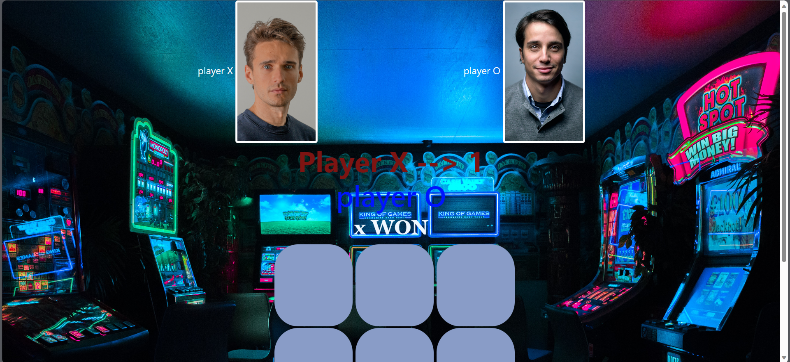
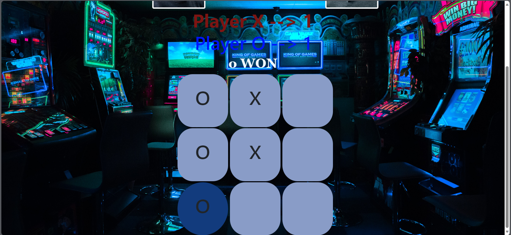

# XO Game

Welcome to the XO Game, a classic two-player Tic-Tac-Toe game with a modern twist! This simple web-based game allows you to play against a friend and keep track of your scores.

## Table of Contents

- [Introduction](#introduction)
- [Getting Started](#getting-started)
- [Gameplay](#gameplay)
- [Features](#features)
- [Screenshots](#screenshots)
- [Contributing](#contributing)
- [License](#license)

## Introduction

XO Game is a web-based implementation of the popular game Tic-Tac-Toe, where two players take turns marking cells in a 3x3 grid with their respective symbols ('X' and 'O'). The player who succeeds in placing three of their marks in a horizontal, vertical, or diagonal row wins the game. If no player achieves this and all cells are filled, the game results in a tie.

This project is built using HTML, CSS, and JavaScript and includes a simple user interface for an enjoyable gaming experience. You can also keep track of your wins and ties as you play!

## Getting Started

To play the XO Game, follow these simple steps:

1. Clone the repository to your local machine:

   ```bash
   git clone https://github.com/seifbasel/web-project2-X-O-GAME
   ```

2. Open the `index.html` file in your web browser.

3. Enjoy the game with a friend! Take turns clicking on the empty cells to make your move.

## Gameplay

- Player X starts the game, and players take turns alternately.
- Click on an empty square to place your symbol ('X' or 'O') in it.
- The game ends when one player wins by forming a line of three symbols or when all squares are filled, resulting in a tie.
- The scores for both players (Player X and Player O) are displayed, and you can track your victories and ties.

## Features

- **Two-Player Gameplay:** Play against a friend on the same device and take turns making moves.
- **Winning and Tie Conditions:** The game accurately detects winning combinations and ties, announcing the winner or declaring a tie.
- **Score Tracking:** Keep track of your wins as Player X and Player O.
- **Responsive Design:** The game is designed to work smoothly on various screen sizes, making it accessible on both desktop and mobile devices.

## Screenshots



## Contributing

We welcome contributions to improve the XO Game. If you have any ideas for new features, bug fixes, or improvements, please feel free to open an issue or submit a pull request. We appreciate your input!

## License

This project is licensed under the [MIT License](LICENSE), so you are free to use, modify, and distribute it as you see fit.

---

Enjoy playing the XO Game and have fun! If you encounter any issues or have suggestions for improvements, please don't hesitate to let us know by opening an issue. Happy gaming!
